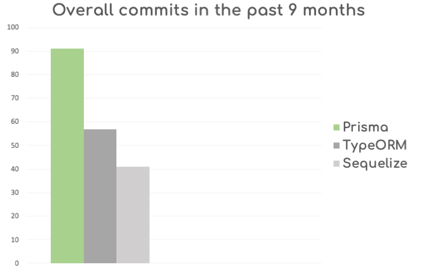
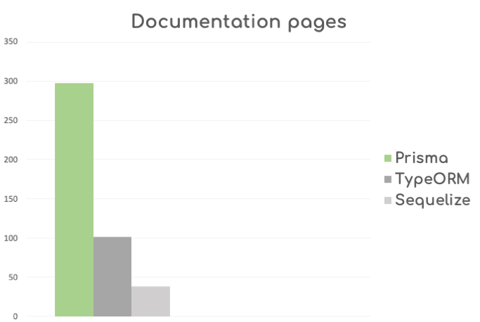

## Intro - Why discuss yet another ORM (or the man who had staints on his suite)?

Mention practica.js, apply thresholds in learning (test runners example), here is something new, Node.js is like suite with staints, this is a strategic discussion

I would keep my ORM sleep but although this duck

"If it looks like a duck, swims like a duck, and quacks like a duck, then it probably is a duck" but this duck wears Louie Vitton bag, is being all over news, so I had to step out my ORM cave

Is it a really that different? Should it surely be your next project even ORM? If you're the 'raw queries' girl, should you stop this pesky habit and switch to ORMs now? Let's find out

## TOC

1. Things that are mostly the same
2. Different things
3. Closing

## What is the same?

Sometimes the easiest way to understand differences between options, is to understand first what is similar

Performance, core features, migration, seeding, transaction, popularity, database specific column types, Uni-directional, bi-directional and self-referenced relations, pagination, Streaming raw results, db types, cli, upsert

## What is fundamentally different?

<!--truncate-->
### 1. Type safety across the board

**🌈 Ideas:** Show query with relations that is not typed in Sequelize/TypeORM, should query with group and counts not typed in Sequelize/TypeORM, show the weird TS interface that seq/to have + the 4 different syntax - but also the non-standard workflow that Prisma client brings, other ideas here?

**💁‍♂️ What is it about:** ORM's life is not easier since the TypeScript rise, to say the least. The need to support typed models/queries/etc yields a lot of developers sweat. Sequelize, for example, struggle to stabilize a TypeScript interface and by now offers 3 different syntaxes + one external library (sequelize-typescript) that offers yet another style. Look at the syntax below, this feels like an afterthought - a library that was not built for TypeScript and now tries to squeeze it in somehow. Despite the struggle, both Sequelize and TypeORM offer only partial type safety. Simple queries do return typed objects, but other common corner cases like attributes/projections leave you with brittle strings. Here are few examples:


```javascript
// Sequelize pesky TypeScript interface
type OrderAttributes = {
  id: number,
  price: number,
  // other attributes...
};

type OrderCreationAttributes = Optional<OrderAttributes, 'id'>;

class Order extends Model<InferAttributes<Order>, InferCreationAttributes<Order>> {
  declare id: CreationOptional<number>;
  declare price: number;
}
```

```javascript
// Sequelize loose query types
await getOrderModel().findAll({
    where: { noneExistingField: 'noneExistingValue' },// TypeScript will catch this 👍
    attributes: ['none-existing-field', 'another-imaginary-column'], //none existing columns 😟
    include: 'no-such-table', //none existing table 😟
  });
  await getCountryModel().findByPk('price');//price is not a primary key column 😟
```

Isn't it ironic...

**📊 How important:** 

**🤔 How Prisma is different:** It takes a totally different approach by generating per-project client code that is fully typed. This client embodies types for everything: every query, relations and others. While other ORMs struggle to infer all the types from discrete models (including associations that are declared in other files), Prisma's offline code generation is easier: It can look through the entire DB relations, use custom generation code and build an almost perfect TypeScript experience. Why 'almost' perfect? for some reason, for migrations Prisma advocates using plain SQL which might result in a discrepancy between the code models and the DB schema. Other than that, this is how Prisma's client brings end to end type safety:


```javascript
await prisma.order.findUnique({
    where: {
      noneExistingField: 1, // TypeScript will catch this 👍
    },
    select: {
      noneExistingRelation: { // TypeScript will catch this 👍
        select: { id: true }, 
      },
      noneExistingField: true, // TypeScript will catch this 👍
    },
  });

  await prisma.order.findUnique({
    where: { price: 50 }, // Price has no unique constraint, TypeScript will catch this 👍
  });
```

**🏆 Is Prisma doing better?:** Definitely

## 2. Progress and maintenance


**💁‍♂️ What is it about:** OSS shines with small to medium libraries, history shows that larger project that demands massive maintenance work - the team is likely to struggle and even fade away. ORM is a maintenance beast - making it follow all the trends (e.g., ESM, TypeScript, new DB) with a volunteering team is almost not fair. Few years ago the future of TypeORM seemed very cloudy with people wondering whether it's still maintained 


With that, as of 2023, I was cheered up to realize how vibrant are TypeORM and Sequelize repositories. As part of writing this article I measured the GitHub traction and while Prisma seems to be superior, the 'pure' OSS alternatives are in a surprisingly in a good shape. All the appreciation of the world for the people who make this awesome OSS work. See graphs below


**📊 How important:** 

**🤔 How Prisma is different:** With [40M$ in its pocket](https://techcrunch.com/2022/05/03/prisma-raises-40m-for-its/?guccounter=1&guce_referrer=aHR0cHM6Ly93d3cuZ29vZ2xlLmNvbS8&guce_referrer_sig=AQAAAHBus4GsueUUPsvSXnhV0LR76aKwoLAu93rGk7D3TDdH2umce0jtkhQ_NvbA008svtEk-PHUl9e3xjsf7AP3k2WxR2JEk8J5rDldXywyxQsMRnkCcHuHdoDG4EyFs2R8z25HXG8qehbHiGOE2knjCOGTZlzRQzLhTONVQB7hL9xo) and 80 employee (!) Prisma should fire features like a machine gun. While looking at the numbers, x3 more commits for example, it definitely has more contribution, but the differences seem rather marginal than dramatic



(Based on two Prisma's repository: [prisma/prisma](https://github.com/prisma/prisma) and [prisma-engines](https://github.com/prisma/prisma-engines))

Metrics: issues age, amount of issues, patreon, downloads, 


**🏆 Is Prisma doing better?:** Yes, but the alternatives are also doing well

## 3. No active records here!

**💁‍♂️ What is it about:** Node in its early days was heavily inspired by Ruby (e.g., testing "describe"), many great patterns were embraced, [Active Record](https://en.wikipedia.org/wiki/Active_record_pattern) is not among the successful ones. What is this pattern about in a nutshell? say you deal with Orders in your system, with Active Record an Order object/class will hold both the entity properties, possible also some of the logic functions and also CRUD functions. Many find this pattern to be awful, why? ideally, when coding some logic/flow, one should not keep her mind busy with side effects and DB narratives. It also might be that accessing some property unconsciously invokes a heavy DB call (i.e., lazy loading). If not enough, in case of heavy logic, unit tests might be in order (i.e., read ['selective unit tests'](https://blog.stevensanderson.com/2009/11/04/selective-unit-testing-costs-and-benefits/)) - it's going to be much harder to write unit tests against code that interacts with the DB. In fact, all of the respectable and popular architecture (e.g., DDD, clean, 3-tiers, etc) advocate to 'isolate the domain', separate the core/logic of the system from the surrounding technologies. With all of that said, both TypeORM and Sequelize support the Active Record pattern which is displayed in many examples within their documentation. Both also support other better patterns like the data mapper (see below), but they still open the door for doubtful patterns


```javascript
// TypeORM active records 😟

@Entity()
class Order extends BaseEntity {
    @PrimaryGeneratedColumn()
    id: number

    @Column()
    price: number

    @ManyToOne(() => Product, (product) => product.order)
    products: Product[]

    // Other columns here
}

function updateOrder(orderToUpdate: Order){
  if(orderToUpdate.price > 100){
    // some logic here
    orderToUpdate.status = "approval";
    orderToUpdate.save(); // Side effect, harder to unit test this function 😟
    orderToUpdate.products.forEach((products) =>{ // Remarkable query just went out (lazy loading), am I aware? 😟

    })
    orderToUpdate.usedConnection = ? // Should I assign this? Entity is cluttered with distracting DB related information 😟
  }  
}


```

**📊 How important:** 

**🤔 How Prisma is different:** The better alternative is the data mapper pattern. It acts as a bridge, an adapter, between simple object notations (domain objects with properties) to the DB language, typically SQL. Call it with a plain JS object, POJO, get it saved in the DB. Simple. It won't add functions to the result objects or do anything beyond returning pure data, no surprising side effects. In its purest sense, this is a DB-related utility and completely detached from the business logic. While both Sequelize and TypeORM support this, Prisma offers *only* this style - no room for mistakes.


```javascript
// Prisma approach with a data mapper  👍

// This was generated automatically by Prisma
type Order {
    id: number

    price: number

    products: Product[]

    // Other columns here
}

function updateOrder(orderToUpdate: Order){
  if(orderToUpdate.price > 100){
    orderToUpdate.status = "approval";
    prisma.order.update({ where: { id: orderToUpdate.id }, data: orderToUpdate }); 
    // Side effect 👆, but an explicit one. The thoughtful coder will move this to another function. Since it's happening outside, mocking is possible 👍
    products.forEach((products) =>{ // No lazy loading, the data is already here 👍

    })
  }  
}
```

 In [Practica.js](https://github.com/practicajs/practica) we take it one step further and put the prisma models within the "DAL" layer and wrap it with the [repository pattern](https://learn.microsoft.com/en-us/dotnet/architecture/microservices/microservice-ddd-cqrs-patterns/infrastructure-persistence-layer-design). You may glimpse [into the code here](https://github.com/practicajs/practica/blob/21ff12ba19cceed9a3735c09d48184b5beb5c410/src/code-templates/services/order-service/domain/new-order-use-case.ts#L21), this is the business flow that calls the DAL layer

## 4. Documentation


**💁‍♂️ What is it about:** TypeORM and Sequelize documentation is mediocre, TypeORM might be a little better. Based on my personal experience they do get a little better over the years, but still by no mean they deserve to be called "good" or "great". For example, if you seek to learn about 'raw queries' - Sequelize offers [a very short page](https://sequelize.org/docs/v6/core-concepts/raw-queries/) on this matter, TypeORM info is spread in multiple other pages. Looking to learn about pagination? Couldn't find Sequelize documents, TypeORM has [some short explanation](https://typeorm.io/select-query-builder#using-pagination), 150 words only


**📊 How important:** 

**🤔 How Prisma is different:** Prisma documentation rocks! See their documents on similar topics: [raw queries](https://www.prisma.io/docs/concepts/components/prisma-client/raw-database-access) and [pagingation](https://www.prisma.io/docs/concepts/components/prisma-client/pagination), thousands of words, and dozens of code examples. The writing itself is also great, feels like some professional writers were involved


 
 This chart above shows how comprehensive are Prisma docs (Obviously this by itself doesn't prove quality)


**🏆 Is Prisma doing better?:** You bet

## 5. Metric and tracing

**🌈 Ideas:** Example of Prometheus and OpenTracing, show that some is achievable with Sequelize/TypeORM but not as mature and easy to use

**💁‍♂️ What is it about:** 


```javascript
// Problem with Sequelize, include is string, count is string
// Weird syntax
```

**📊 How important:** Image of bar

**🤔 How Prisma is different:** Foo

```javascript
// Example of include and count
// Raw with types
```


**🏆 Is Prisma doing better?:** I think so

## Closing

I hope that these thoughts, at least one of them, made you re-consider adding a new technique to your toolbox. In any case, let's keep our community vibrant, disruptive and kind. Respectful discussions are almost as important as the event loop. Almost.

## Some of my other articles

- [Book: Node.js testing best practices](https://github.com/testjavascript/nodejs-integration-tests-best-practices)
- [Book: JavaScript testing best practices](https://github.com/testjavascript/nodejs-integration-tests-best-practices)
- [How to be a better Node.js developer in 2020](https://yonigoldberg.medium.com/20-ways-to-become-a-better-node-js-developer-in-2020-d6bd73fcf424). The 2023 version is coming soon
- [Practica.js - A Node.js starter](https://github.com/practicajs/practica)
- [Node.js best practices](https://github.com/goldbergyoni/nodebestpractices)


**Ideas**

**Ideas**
N+1
E
It's repository pattern! No polymorphic look
GIS
Serverless heavy
Protection - at least one unique field, varchar-191, 
"break down quickly" - not true, it's hard to break it
Find and count all

** Complicaiton **
Compare field with field, group with count, distinct, views, triggers
Not supported: materialized view, 
Group by and count: https://sebhastian.com/sequelize-group-by/
Cursor based
Prisma prevents shooting in the foot
Opening - An opprtunity to see a from the ground up ORM
Opening - Node.js is like an elegant man with tints, do we finally have the NHibernate?, 
Ending - It might be NHibernate, not yet
Check GitHub extensions
Example how Prisma abstratcs - you can insert multiple M2M records (posts & categories in one call)
Performance tests
Error handling
License: "It allows users to use the software for any purpose, to distribute it, to modify it, and to distribute modified versions of the software under the terms of the license, without concern for royalties"
Prisma is shooting at 3 important things
Automatic transaction

TO and Seq don't really have mapper